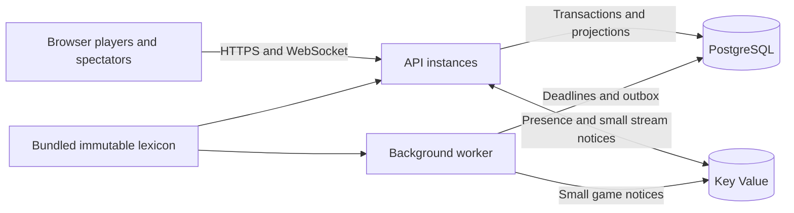

# BestWord implementation architecture

This describes the implemented repository, reviewed on 18 September 2026. [DECISIONS.md](DECISIONS.md) records the agreed rules; [OPERATIONS.md](OPERATIONS.md) covers deployment and recovery. The source files linked below are the authority when implementation details change.

## Runtime boundaries

BestWord is an npm workspace using Node 24 and strict TypeScript. The browser is React 19, React Router, Zustand and Socket.IO Client, built by Vite 8. The API is Fastify 5 with Socket.IO 4. PostgreSQL 18 stores durable state; Redis-compatible Key Value provides presence, rate limits and notification transport. Critical database operations use explicit parameterized SQL through `pg`; a Drizzle handle is available, but the transaction and locking logic is in the server code.

The same application image runs the API entry point, continuous deadline/outbox worker, or dedicated AI worker. The API serves the built browser assets and all HTTP/WebSocket traffic from one origin. There is no separate browser hosting service, application filesystem database, game owner process, or in-memory authoritative game registry.



| Location | Responsibility |
|---|---|
| [packages/contracts](../packages/contracts/src/index.ts) | Shared public types, Zod validation, action and reply formats |
| [packages/engine](../packages/engine/src/index.ts) | Pure rules, seeded setup, draws, scoring, clocks, outcomes, invariants and projections |
| [packages/lexicon](../packages/lexicon/src/index.ts) | Verified immutable GADDAG artifact loader and word/traversal queries |
| [apps/server](../apps/server/src/app.ts) | HTTP, sessions, transactions, coordination, health and scheduling |
| [apps/web](../apps/web/src/Game.tsx) | Local input draft, rendering, live views, retry and signed-in replay |
| [tools/lexicon-builder](../tools/lexicon-builder/README.md) | Offline Rust compiler and independent dictionary audits |

The original dictionary is compiled offline. Each runtime process opens and verifies the bundled compressed artifact once; startup does not rebuild the vocabulary. Each stored game has a rules version and source dictionary SHA-256. A command is rejected if that game's dictionary version differs from the loaded artifact. Keep the artifact and rules compatible across all processes that can touch an active game.

## PostgreSQL is the game authority

[db.ts](../apps/server/src/db.ts) defines the schema and transaction wrapper. A `games` row contains the full private engine snapshot as JSONB, a revision, status, indexed deadlines/check time, participant gateway epochs and handled incident IDs. The snapshot includes the board, racks, bag, predetermined consonant draw order, clocks, principal history and accepted moves. Recovery loads this snapshot; it does not redraw tiles or reconstruct current state from Redis.

Supporting tables have explicit roles:

| Tables | Durable responsibility |
|---|---|
| `users`, `sessions` | Case-insensitive usernames, Argon2id password hashes and hashed opaque session tokens |
| `game_players`, `playing_slots` | Participant membership and the one-active-game-per-account constraint |
| `seeks` | Open matchmaking requests with expiry and unique user ownership |
| `game_events` | Setup and public transition records keyed by game/revision |
| `commands` | Idempotency receipts keyed by game/user/command ID, with payload hash and original result |
| `outbox` | Committed changes awaiting notification publication |
| `service_epochs`, `incidents` | Durable dependency health, process identity and outage/deployment evidence |
| `schema_migrations` | Applied schema version |

The implementation keeps both snapshots and events. It reads snapshots for gameplay and supplies accepted public moves for replay; it is not an event-only state-reconstruction system.

### Accepting an action

[Games.command](../apps/server/src/games.ts) runs the following path inside a PostgreSQL transaction:

1. Lock only the target game row with `SELECT ... FOR UPDATE` and verify participant membership.
2. Hash the action and expected revision, then look up its command receipt. A repeated ID with the same payload returns the original result before new deadline or revision checks. A different payload reusing that ID is rejected.
3. Obtain the acceptance time from PostgreSQL's `clock_timestamp()`. Apply rate limits and settle any due clock, presence or infrastructure transition using current health evidence.
4. Check status, expected revision and dictionary version, then call the pure engine. The server calculates legality, score, draw and clocks; client-supplied scores or clock values are never accepted.
5. Persist the resulting snapshot, public event, pending outbox record and command receipt in the same transaction. Release playing slots for participants who passed or whose game finished.
6. Commit, attempt publication, and reply. A publication failure leaves the outbox pending and does not undo an accepted action. A commit whose outcome is uncertain produces no successful acknowledgement; retrying the same command ID resolves whether it committed.

Two instances submitting actions to the same game serialize on that row. Unrelated games use separate transactions. `expectedRevision` detects stale concurrent input. A successful retry reports the original `acceptedRevision` with the latest projected game view, so old acknowledgements do not require displaying an obsolete board. Rejected rule actions also receive stored receipts; a corrected action needs a new command ID.

Game admission has a separate, short advisory transaction lock to enforce the configured global active-game cap while claiming a seek. Schema migration uses another advisory lock. Neither lock serializes normal gameplay across all games.

Database connections have bounded connect, statement, read and idle-transaction times. The wrapper retires uncertain/broken connections instead of returning them to the pool. This prevents a half-open dependency connection from indefinitely holding a game transaction or contaminating the next request. See the exact limits and error handling in [db.ts](../apps/server/src/db.ts).

## Notifications and private projections

[realtime.ts](../apps/server/src/realtime.ts) uses two distinct Redis Streams:

- `bw:game-updates` carries only `gameId`, `revision` and a finished flag. Publication awaits the actual `XADD` result before retiring the corresponding PostgreSQL outbox records. The stream is approximately trimmed to 10,000 entries.
- `bw:socket-stream` is the Socket.IO Redis Streams adapter transport for shared room operations, lobby notifications, match notifications and cross-instance disconnects. It is also bounded to approximately 10,000 entries.

Full game snapshots, private racks and stored draw order are not placed in the game notification stream. Every gateway consumes its own copy of the game notices, coalesces repeated notices per game, and fetches state only for games with local `watch:<gameId>` membership. It limits concurrent fetch/delivery work to four games. A gateway fetches each interested game once per batch, then creates local player and spectator projections.

Outbox workers claim pending rows with `FOR UPDATE SKIP LOCKED` and a temporary claim expiry. Publication may happen more than once; revision checks make duplicate delivery harmless. A notice is a hint to fetch the current snapshot, not the authoritative move itself. A trimmed or missed notice is repaired by subscription or periodic revision synchronization.

### Privacy boundary

The engine's `projectGame` produces a public `game` object and a nullable private `you` object. Public state includes scores, rack **sizes**, exact vowel counts, total remaining consonants, clocks and board. Signed-in viewers also receive accepted moves; guests receive only the latest three summaries, tile origins and latest placement. Only the participant's own `you` object contains rack letters, that turn's draw count and NO WORDS eligibility. It never includes the other rack, per-consonant bag counts or stored future draws. Drafts remain in the browser until an action is submitted.

Private socket rooms have this shape:

```text
game:<gameId>:player:<seat>:session:<tokenHash>
```

Before every private publication, the gateway queries unexpired PostgreSQL sessions and sends only to their session-specific rooms. Guests receive the separate `game:<gameId>:spectators` projection with `you: null` and withheld full history. Signed-in spectators use `game:<gameId>:spectators:session:<tokenHash>` and their session is rechecked before every full-history publication. Game data delivery uses `io.local`; private payloads therefore do not enter the shared adapter stream.

Opaque session tokens are stored only as hashes in PostgreSQL. The cookie is HttpOnly, SameSite=Lax and Secure in production. Username uniqueness, registration and session issuance are transactional. Password changes revoke prior sessions and create the replacement atomically. Session/user rooms support prompt socket disconnection on logout or password change, but privacy also depends on the database session check before publication and on every command/sync, so a missed disconnect notification does not authorize future private data. The heartbeat also revalidates sessions in batches.

## Presence, deadlines and recovery

Socket.IO uses a 5-second heartbeat and a 10-second heartbeat timeout. Each game connection has a presence member `<gatewayEpoch>/<socketId>`. Redis sorted-set leases expire after 16 seconds and are refreshed every 5 seconds; keys have a 45-second expiry. Presence writes use bounded Lua batches of 200 entries. Multiple valid game tabs can keep one participant connected. Spectator leases and admission are separate and never establish a player's health evidence.

Ordinary player disconnection starts the agreed 25-second allowance from server detection. An active clock continues during that allowance. A passed participant no longer needs to remain connected. Expired leases recover missed socket-disconnect callbacks; this is why closing a process and losing an ordinary player connection must be distinguished.

[Health](../apps/server/src/health.ts) assigns every API/worker process a unique epoch. A healthy API checkpoint is stored in PostgreSQL every second after a successful Key Value probe; the probe happens after acquiring the epoch lock so an old probe cannot become a fresh checkpoint. A failed or uncertain database commit never advances the locally trusted checkpoint.

Before a final loss, the server requires positive participant-gateway health evidence **after** the candidate deadline. Missing evidence keeps the outcome pending. A checkpoint gap longer than three seconds, a recorded dependency failure, or a deployment incident triggers infrastructure handling. Games record relevant participant gateway epochs; a healthy alternative tab on another gateway can prevent an unrelated gateway outage from pausing that participant's game.

On confirmed infrastructure trouble, the engine freezes clocks and reconnect allowances from the last trustworthy boundary, clamped between the game's latest committed transition and the current acceptance time. It preserves the existing board, score, racks and draw state. Acknowledged actions are never rolled back merely because their gateway later fails. Incident IDs are tracked so repeated scans do not repeatedly restart recovery.

After dependencies recover, remaining non-PASS participants have up to 120 seconds to reconnect. Once they are ready, the server resumes through a three-second countdown. If the recovery allowance expires with a required participant absent, it closes the game without a winner. A new infrastructure incident can restart recovery; an ordinary repeated scan cannot. Graceful API shutdown records a deployment incident and tells clients to reconnect before closing sockets.

The worker and every API instance run deadline/outbox scheduling. They claim batches of at most 100 candidate games with `SKIP LOCKED`, then process short independent per-game transactions with bounded concurrency. A dedicated worker therefore improves scheduling isolation, while its death does not silently strand deadlines. `next_deadline` and `next_check` support due work and periodic presence reconciliation. All paths still settle state under the game-row lock before applying a new action.

Key Value command replies have a separate 1.5-second bound in addition to client socket/queue settings. Timed-out or partially enqueued batches cause the connection to be replaced. Blocking stream-reader connections use their own reconnect-friendly settings so transient Redis failure cannot create an immediate retry loop that starves timers. These choices are implemented in [kv.ts](../apps/server/src/kv.ts) and `realtime.ts`.

## Browser synchronization and replay

The AI extension is detailed in [AI.md](AI.md). A durable `ai_jobs` row is created with the game transition. A dedicated service claims each job with a fencing token and computes its move in a bounded worker thread. The normal engine validates and commits it under the same game lock used for human actions. The saved game pins difficulty, vocabulary hash and policy version. AI health replaces browser presence for the computer seat; a compatible worker restart can resume it. Only public board/bag information and the AI's own rack enter search.

Recent-game refresh merges new pages with already loaded pages and preserves the oldest cursor and scroll anchor. Replay navigation preserves its selected move through sign-in. The shared help dialog embeds the unchanged versioned tutorial locally and leaves the active game mounted, so opening help does not disconnect a player or pause their clock.

The browser first loads a projected view over HTTP and subscribes over WebSocket. It anchors server timestamps to local `performance.now()` and advances displayed deadlines with that monotonic elapsed time. Changing the device wall clock does not expire a turn or change input eligibility. The browser never decides a server result. Paused clocks stay frozen, and a locally expired deadline disables input until the server confirms the outcome.

Every eight seconds a connected game sends `game:sync {gameId, revision}`. An already subscribed socket with the same valid identity, the same revision, and a game that is not paused receives `{ok:true, unchanged:true, serverTime}`. The client refreshes its server-time anchor without replacing the snapshot, revision, projected remaining times or draft. It ignores a stale clock timestamp and does not apply an unchanged reply if its game or revision has since changed. Otherwise the server performs a full subscription and returns a current personalized view. Paused games deliberately use the full path so recovery presence can be reconciled.

Changed-state `game:update` messages contain the receiver's authorized projection. Signed-in accounts receive complete public history, while guests receive the current board, tile origins and three recent move summaries without replay history. Only a participant receives their own rack letters. There is no client delta protocol or authenticated history pagination yet. Revision-aware polling saves unchanged downloads but does not make authenticated changed-game bandwidth independent of game length or spectator count.

The client ignores older revisions and older timestamps within the same revision. A pending command is saved per tab in `sessionStorage`, with its UUID and expected revision, before transmission. An acknowledgement timeout or `SERVICE_RECOVERING` reply preserves that command for safe retry using the same ID: either can follow an ambiguous commit. Editing and creating another action waits for resolution. Success and definitive rejections clear the pending receipt; an ordinary invalid placement preserves the local draft. The draft helper independently handles input placement/inference, while final legality remains on the server.

Lobby lists refresh on notifications, connection and a 15-second interval. Authenticated refresh includes `/api/session` and its `activeGameId`; a committed match is therefore discoverable even if `game:matched` was lost. Direct notifications provide prompt navigation, and the session view provides a recoverable Continue game link.

Signed-in replay uses only accepted public moves. The client derives the original seed board by removing accepted new tiles from the final board, then reapplies tiles and scores up to the selected move. It does not invent historical racks, expose future draws, or display reconstructed clock histories.

## Deployment and scaling limits

[render.yaml](../render.yaml) defines one API, one deadline/outbox worker, one AI worker, PostgreSQL 18 and Key Value in Virginia. All three application roles use the same Docker image and bundled lexicon. The image runs as the unprivileged `node` user and needs no persistent application disk. Production assets have prebuilt Brotli/gzip variants; hashed assets use immutable caching, while the HTML entry point requires revalidation. HTTP and WebSocket origins are configured together with `APP_ORIGIN`.

WebSocket-only transport allows new/reconnected sockets to land on any API instance without a polling-session affinity requirement. Shared database locks, receipts, sessions, presence and notifications allow two players in the same game to connect to different instances. There is no application-level game sharding or worker leader election to reconfigure when adding an instance.

Adding instances still consumes shared resources. Total database pool capacity grows with API count times `DB_POOL_SIZE`, plus each worker's pool capped at five connections. More instances also add heartbeat work, stream readers and projection reads for games represented on those instances. One busy game remains serialized; its spectators still require outgoing data. PostgreSQL, Key Value, CPU, memory, bandwidth and load-client capacity must all be measured together.

The initial Blueprint admission limits are **100 active games** and **10 spectators per game**. These are operating limits, not benchmark results. The reviewed base-cost estimate in [OPERATIONS.md](OPERATIONS.md) is US$89/month before usage and tax; it is neither a hard US$100 billing cap nor a claim that 5,000 simultaneous games fit that budget. Recheck provider pricing before provisioning.

Functional integration tests exercise multiple real gateways and durable retries. Local browser and backup verification are recorded in [client progress](progress/client.md) and [backup progress](progress/backup.md). Only completed [load reports](../tools/load/README.md), with their actual hardware, workload, duration, sync setting, compiled-code hashes and individual gates, establish measured local capacity. A configured 5,000-game scenario alone establishes nothing about achieved throughput or Render service sizes. Any short run, omitted periodic sync, driver bottleneck or failed gate must remain visible in a capacity claim. The repository has not itself provisioned or measured a public Render deployment.

## Saved interface evidence

The AI release's successful Chromium run captured the new computer setup and tutorial on desktop and the smallest supported portrait viewport. Both were visually reviewed:

- [Computer game setup](evidence/ai-desktop-computer.png)
- [Tutorial on a small phone](evidence/ai-small-phone-tutorial.png)

The prior human-game release also includes actual WebKit screenshots using the compiled application, PostgreSQL and Redis. Both show the same live game after setup, with valid seed words REDEMPTIONS and POLYTYPES and the participant's own rack. Viewports were 1280×800 and 320×568 CSS pixels; WebKit captured them at device scale factor 2.

- [Desktop live game](evidence/desktop-game.png)
- [Smallest supported portrait live game](evidence/small-phone-game.png)
